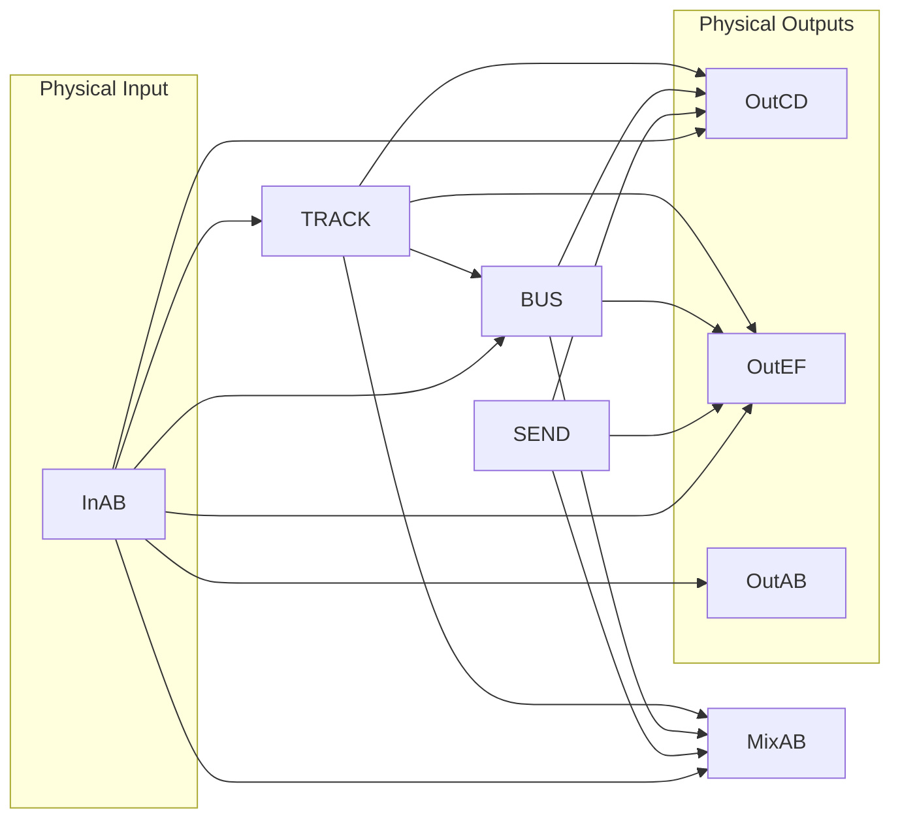

# Available Routing Options

Understanding the available routing destinations is helpful to assess possible Tonverk use-cases and signal chains.

---
This diagram visualizes the possible audio paths within Tonverk: From physical Inputs to Tracks, Busses, and physical Outputs.

    Direct Monitoring: Inputs can be routed directly to outputs, bypassing the internal tracks.

    Bus Processing: Routing Tracks to the BUS allows for group processing before hitting the main outs.